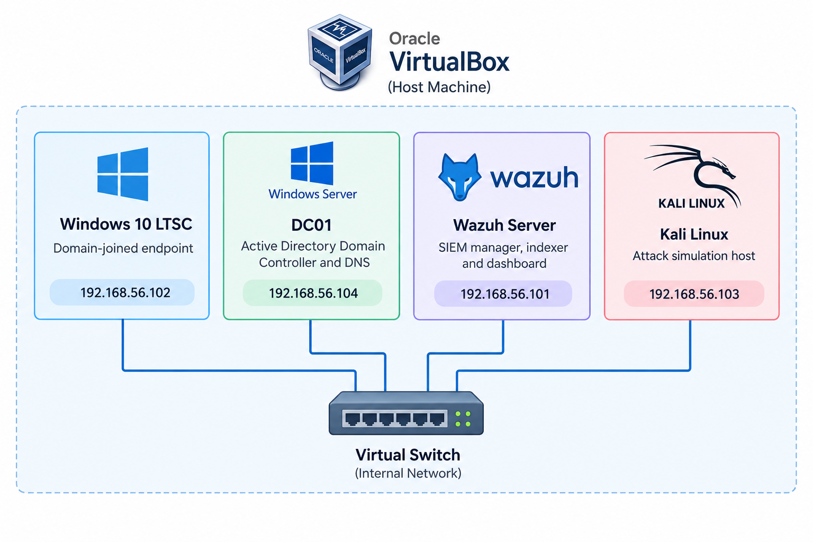
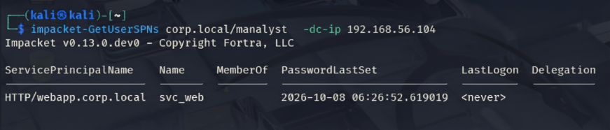
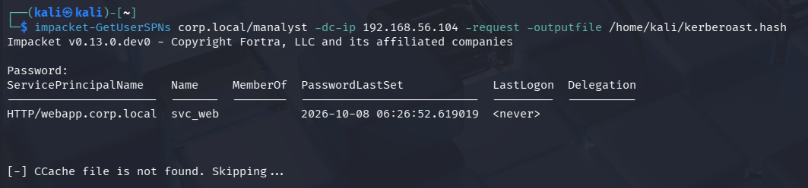
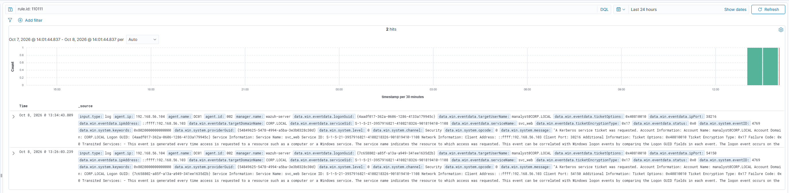

# Kerberoasting Detection with Active Directory and Wazuh

> All testing was performed in an isolated and authorized lab environment for educational purposes.

## 1. Objective

This lab simulates and detects a controlled **Kerberoasting** activity against an Active Directory service account using Kali Linux, Windows Server Domain Controller telemetry, and Wazuh SIEM.

The objective was to:

- Configure an Active Directory domain with a service account and SPN.
- Request a Kerberos service ticket for the service account.
- Capture Windows Security Event ID `4769`.
- Identify the use of RC4-HMAC encryption (`0x17`).
- Forward the event from the Domain Controller to Wazuh.
- Create a custom Wazuh rule mapped to **MITRE ATT&CK T1558.003 — Kerberoasting**.
- Validate the generated alert through a SOC-style investigation.

## 2. Lab Environment

The lab consisted of four virtual machines connected through the `192.168.56.0/24` Host-Only network:

| System | Role | IP address |
|---|---|---|
| DC01 | Active Directory Domain Controller and DNS | `192.168.56.104` |
| Windows 10 LTSC | Domain-joined endpoint | `192.168.56.102` |
| Wazuh Server | SIEM manager, indexer and dashboard | `192.168.56.101` |
| Kali Linux | Attack simulation host | `192.168.56.103` |

The Active Directory domain was:

```text
corp.local
```

The relevant domain accounts were:

| Account | Role |
|---|---|
| `manalyst` | Domain user used to request the service ticket |
| `svc_web` | Service account with a registered SPN |

The Wazuh agent was installed on DC01 and configured to forward Windows Security events from the `Security` Event Channel.



## 3. Active Directory Configuration

The SPN associated the service account with the following service:

```text
HTTP/webapp.corp.local
```

Accounts with SPNs can receive Kerberos service tickets. These tickets are relevant for Kerberoasting because their encrypted material can be targeted for offline password recovery.

## 4. Kerberoasting Simulation

First, an enumeration of users and services was made using impacket, and the SPN `HTTP/webapp.corp.local` was found.



The Kerberoasting request was performed from Kali using the domain account `manalyst`:

```bash
impacket-GetUserSPNs corp.local/manalyst \
  -dc-ip 192.168.56.104 \
  -request-user svc_web \
  -outputfile /home/kali/kerberoast.hash
```

The command requested a Kerberos service ticket for the SPN associated with `svc_web`.



## 5. Windows Event Analysis

The Domain Controller generated Windows Security Event ID `4769`.

### Event 4769 – Kerberos Service Ticket Requested

| Field | Value |
|---|---|
| `agent.name` | `DC01` |
| `agent.ip` | `192.168.56.104` |
| `data.win.system.eventID` | `4769` |
| `data.win.system.channel` | `Security` |
| `data.win.eventdata.targetUserName` | `manalyst@CORP.LOCAL` |
| `data.win.eventdata.serviceName` | `svc_web` |
| `data.win.eventdata.ticketEncryptionType` | `0x17` |
| `data.win.eventdata.ipAddress` | `::ffff:192.168.56.103` |
| `data.win.eventdata.status` | `0x0` |
| `data.win.eventdata.ipPort` | `60798` |

**Interpretation:**

- `eventID: 4769` indicates that a Kerberos service ticket was requested.
- `targetUserName: manalyst@CORP.LOCAL` identifies the requesting account.
- `serviceName: svc_web` identifies the target service account.
- `ticketEncryptionType: 0x17` indicates RC4-HMAC encryption.
- `ipAddress: 192.168.56.103` identifies Kali as the requesting host.
- `status: 0x0` indicates that the request succeeded.

## 6. Custom Wazuh Detection Rule

A custom rule was created in Wazuh to bring the alert to the alerts dashboard:

```xml
<group name="windows,authentication,kerberos,kerberoasting,">
  <rule id="110111" level="12">
    <decoded_as>json</decoded_as>
    <field name="win.system.eventID">^4769$</field>
    <field name="win.eventdata.ticketEncryptionType">^0x17$</field>
    <description>Possible Kerberoasting: RC4-encrypted Kerberos service ticket requested.</description>
    <mitre>
      <id>T1558.003</id>
    </mitre>
  </rule>
</group>
```

The rule checks for the following combination:

```text
Event ID 4769
Ticket Encryption Type 0x17
```

## 7. Custom Rule Alert

The rule successfully generated an alert in Wazuh.

| Field | Value |
|---|---|
| `rule.id` | `110111` |
| `rule.description` | `Possible Kerberoasting: RC4-encrypted Kerberos service ticket requested.` |
| `rule.level` | `12` |
| `agent.name` | `DC01` |
| `agent.ip` | `192.168.56.104` |
| `data.win.system.eventID` | `4769` |
| `data.win.eventdata.targetUserName` | `manalyst@CORP.LOCAL` |
| `data.win.eventdata.serviceName` | `svc_web` |
| `data.win.eventdata.ticketEncryptionType` | `0x17` |
| `data.win.eventdata.ipAddress` | `::ffff:192.168.56.103` |
| `rule.mitre.id` | `T1558.003` |



## 8. SOC Triage Assessment

The alert indicates that `manalyst` requested a Kerberos service ticket for `svc_web` using RC4-HMAC encryption from Kali.

This combination is consistent with Kerberoasting activity. However, the alert alone does not prove that the ticket was successfully cracked or that the account password was compromised.

### Investigation points

- Confirm whether `manalyst` was authorized to request the service ticket.
- Verify whether `svc_web` is a legitimate and active service account.
- Check whether `svc_web` has privileged group memberships.
- Review additional 4769 events from the same source IP.
- Identify whether multiple SPNs were requested in a short period.
- Correlate the event with process creation telemetry on Kali or other endpoints.
- Check for subsequent authentication or lateral movement involving `svc_web`.

### Assessment

```text
Detection result: True positive for Kerberoasting-like activity.

Confidence: Medium to High.

Reason:
- Event ID 4769 was generated.
- The target was a service account with an SPN.
- RC4-HMAC encryption type 0x17 was used.
- The request originated from the Kali test host.
- The requesting account was a normal domain user.
```

RC4 is a useful detection signal, but it should be combined with identity, source IP, request frequency and service-account context to reduce false positives. MITRE specifically recommends monitoring anomalous TGS requests, RC4 encryption and unusual request volumes.

## 9. Remediation

The service account password was rotated:

```powershell
Set-ADAccountPassword -Identity svc_web -Reset `
  -NewPassword (ConvertTo-SecureString 'SECURE_PASSWORD' -AsPlainText -Force)
```

Recommended production mitigations include:

- Use long, random passwords for service accounts.
- Prefer group Managed Service Accounts where possible.
- Remove unused SPNs.
- Avoid unnecessary privileges on service accounts.
- Migrate services from RC4 to AES.
- Monitor Event ID `4769` for anomalous TGS requests.
- Review and document all legitimate service accounts and SPNs.

## 10. Detection Summary

| Phase | Evidence | Result |
|---|---|---|
| AD preparation | SPN `HTTP/webapp.corp.local` | Registered on `svc_web` |
| Attack simulation | Impacket `GetUserSPNs` | TGS requested for `svc_web` |
| Windows telemetry | Security Event `4769` | Request recorded by DC01 |
| Encryption analysis | `TicketEncryptionType: 0x17` | RC4-HMAC identified |
| Wazuh ingestion | `archives.json` | Event received by manager |
| Custom detection | Rule `110111` | Alert generated at level 12 |
| MITRE mapping | `T1558.003` | Kerberoasting mapped |
| Remediation | Password rotation and SPN cleanup | Lab restored to a safer state |

## 11. Conclusions

- An Active Directory lab was extended with a Domain Controller, domain accounts and a service account with an SPN.
- A controlled Kerberoasting-like request was performed from Kali using `manalyst`.
- DC01 generated Windows Security Event ID `4769`.
- The event showed a request for `svc_web` using RC4-HMAC encryption type `0x17`.
- Wazuh ingested the event and stored it in the archive data.
- A custom Wazuh rule detected the event and generated a level 12 alert.
- The alert was mapped to MITRE ATT&CK `T1558.003`.
- The lab demonstrated an end-to-end SOC workflow: prepare the environment, simulate activity, collect telemetry, create a detection, validate the alert, perform triage and apply remediation.

