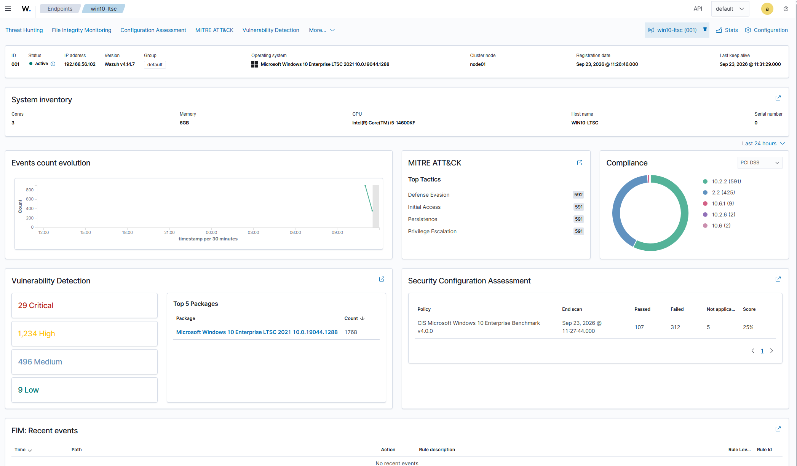
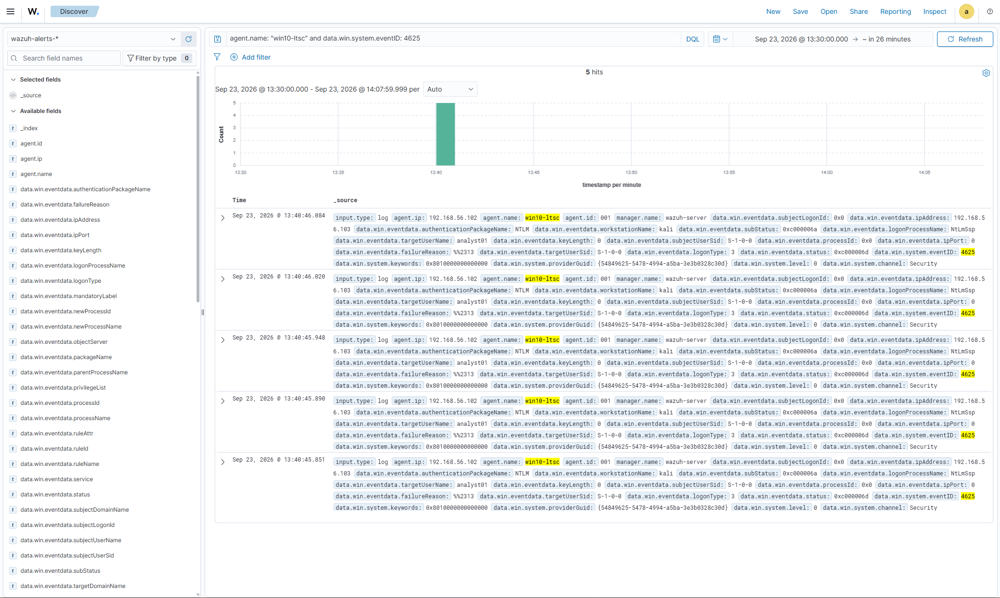
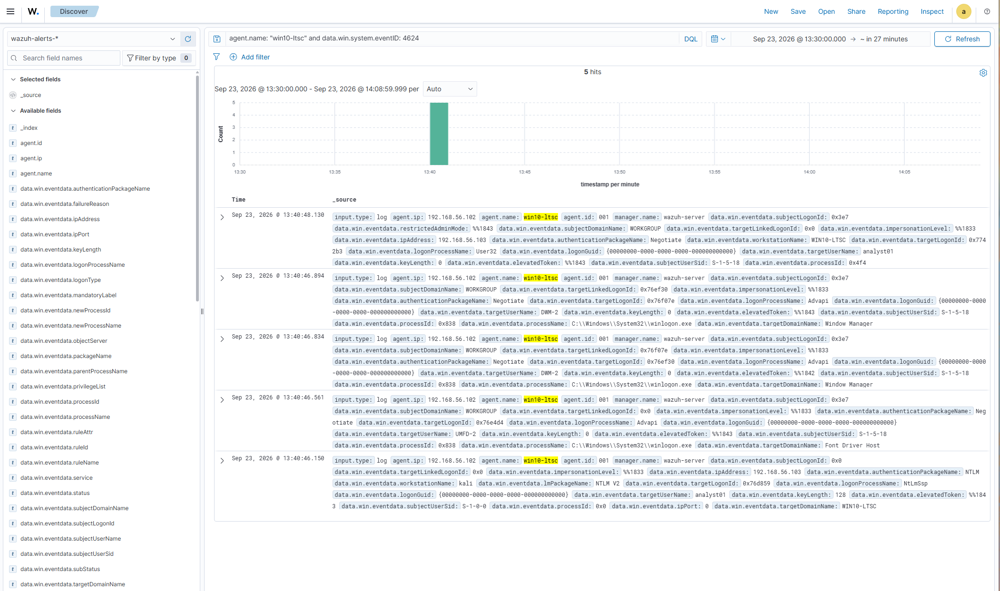

# RDP Brute-Force Detection with Wazuh

## 1. Environment and Architecture

The lab consists of three virtual machines:

- **Kali Linux** (attacker): used to launch the RDP brute-force attack.
- **Windows 10 LTSC** (victim): the target system for RDP access.
- **Wazuh Server** (SIEM): centralizes and analyzes security events.

All VMs are on a **Host-Only** network with the `192.168.56.0/24` subnet:

- Kali: `192.168.56.103`
- Win10-LTSC: `192.168.56.102`
- Wazuh-Server: `192.168.56.101`

The Wazuh agent is installed on the Windows machine and forwards events from the **Security** channel (Event Channel) to the server.



---

## 2. Windows Audit Configuration

On the victim machine (Win10-LTSC), logon auditing was enabled:

- Opened `secpol.msc`.
- In **Advanced Audit Policy Configuration → Logon/Logoff → Logon**, enabled:
  - **Success**
  - **Failure**

This generates the following events:

- **4624**: successful logon.
- **4625**: failed logon (unknown user or bad password).

These events are sent in real-time to the Wazuh server via the agent.

---

## 3. RDP Brute-Force Attack

From Kali, an automated brute-force attack was launched against the Windows target using Hydra, testing multiple incorrect passwords against the user analyst01:

```bash
hydra -l analyst01 -P passwords.txt rdp://192.168.56.102
```
(Where passwords.txt contains a wordlist with several incorrect passwords followed by the correct one).

The tool rapidly sent multiple connection requests, all of which failed initially. Shortly after, once the correct password was tested by the automation script, a successful connection was established.

### Failed Logons



In Wazuh (or Windows Event Viewer), multiple **4625** events are visible, all generated within a short time frame for the user `analyst01` and originating from Kali's IP (`192.168.56.103`).

### Succeeded Logons



After the brute-force, a **4624** event is logged, indicating a successful RDP logon for the same user from the same IP.

---

## 4. Event Analysis in Wazuh

### Event 4625 – Failed Logon (Brute-Force)

| Field | Value |
|-------|-------|
| `agent.name` | win10-ltsc |
| `agent.ip` | 192.168.56.102 |
| `rule.id` | 60122 |
| `rule.description` | Logon Failure - Unknown user or bad password |
| `rule.level` | 5 |
| `data.win.system.eventID` | 4625 |
| `data.win.eventdata.logonType` | 3 |
| `data.win.eventdata.targetUserName` | analyst01 |
| `data.win.eventdata.ipAddress` | 192.168.56.103 |
| `data.win.eventdata.workstationName` | kali |
| `data.win.eventdata.failureReason` | %%2313 (Unknown user or bad password) |
| `data.win.eventdata.status` | 0xC000006D |
| `data.win.eventdata.subStatus` | 0xC000006A |
| `timestamp` | Sep 23, 2026 @ 14:13:40.079 |

**Interpretation:**

- `eventID: 4625` → failed logon.
- `logonType: 3` → network logon (in this context, RDP).
- `targetUserName: analyst01` → targeted user.
- `ipAddress: 192.168.56.103` → attack origin (Kali).
- `failureReason: %%2313` + `status/subStatus` → "unknown user or bad password".

These events are evidence of the RDP brute-force attack.

---

### Event 4624 – Successful Logon (RDP)

| Field | Value |
|-------|-------|
| `agent.name` | win10-ltsc |
| `agent.ip` | 192.168.56.102 |
| `rule.id` | 92653 |
| `rule.description` | User: WORKGROUP\analyst01 logged using Remote Desktop Connection (RDP) from ip:192.168.56.103. |
| `rule.level` | 3 |
| `data.win.system.eventID` | 4624 |
| `data.win.eventdata.logonType` | 10 |
| `data.win.eventdata.targetUserName` | analyst01 |
| `data.win.eventdata.targetDomainName` | WIN10-LTSC |
| `data.win.eventdata.ipAddress` | 192.168.56.103 |
| `data.win.eventdata.workstationName` | WIN10-LTSC |
| `data.win.eventdata.logonProcessName` | User32 |
| `data.win.eventdata.authenticationPackageName` | Negotiate |
| `timestamp` | Sep 23, 2026 @ 14:13:42.157 |

**Interpretation:**

- `eventID: 4624` → successful logon.
- `logonType: 10` → Remote Desktop (RDP).
- `targetUserName: analyst01` → user who successfully logged in.
- `ipAddress: 192.168.56.103` → same origin as the failed attempts.
- `logonProcessName: User32` + rule description → confirms RDP logon.

This event shows that, after the brute-force, successful access to the system was achieved.

---

## 5. Custom Rule for RDP Brute-Force

To reduce noise from isolated authentication mistakes, a custom correlation rule was configured on the Wazuh server. The rule is intended to generate a higher-level alert after five failed logon events are detected within a 60-second window.

File: `/var/ossec/etc/rules/local_rules.xml`

```xml
<group name="custom,windows,rdp,bruteforce,">
  <rule id="100101" level="10" frequency="5" timeframe="60">
    <field name="data.win.system.eventID">^4625$</field>
    <description>RDP brute-force detected - Multiple failed logons (4625)</description>
    <options>no_full_log</options>
  </rule>
</group>

```

## 6. Detection Summary

| Phase | Evidence | Result |
|---|---|---|
| Failed authentication attempts | Windows Event ID 4625 | Multiple failed logons from `192.168.56.103` |
| Successful authentication | Windows Event ID 4624 | Successful RDP logon using `logonType: 10` |
| Wazuh detection | Rules `60122` and `92653` | Failed and successful logons ingested and classified |
| Custom correlation | Rule `100101` | Configured to detect repeated failures within 60 seconds |

---

## 7. Conclusions

- A lab was set up with Kali, Windows 10, and Wazuh to simulate an **RDP brute-force** attack.
- Logon auditing was configured on Windows to generate **4624** and **4625** events.
- From Kali, multiple failed logon attempts were performed, followed by a successful logon.
- Wazuh ingested and correlated the events, allowing identification of:
  - The brute-force pattern (multiple 4625 events in a short time).
  - The subsequent successful access (4624 with logonType 10).
- A custom rule was created to alert when multiple failed logons occur within a short period of time.

This exercise demonstrates how Wazuh can be used to detect brute-force attacks against RDP and how to create custom rules to adapt the SIEM to specific needs.