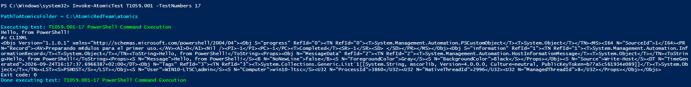
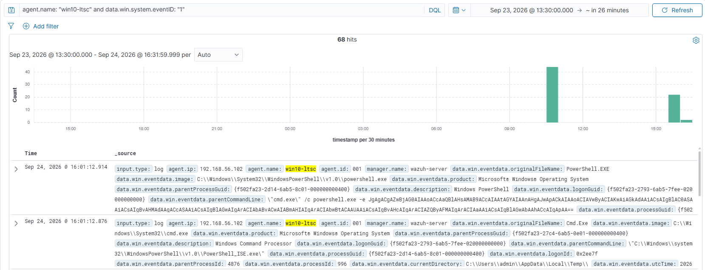
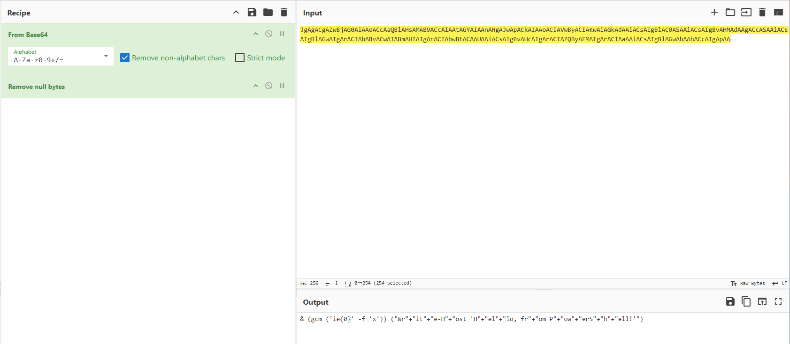
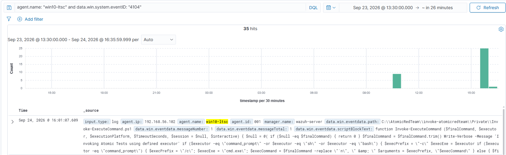
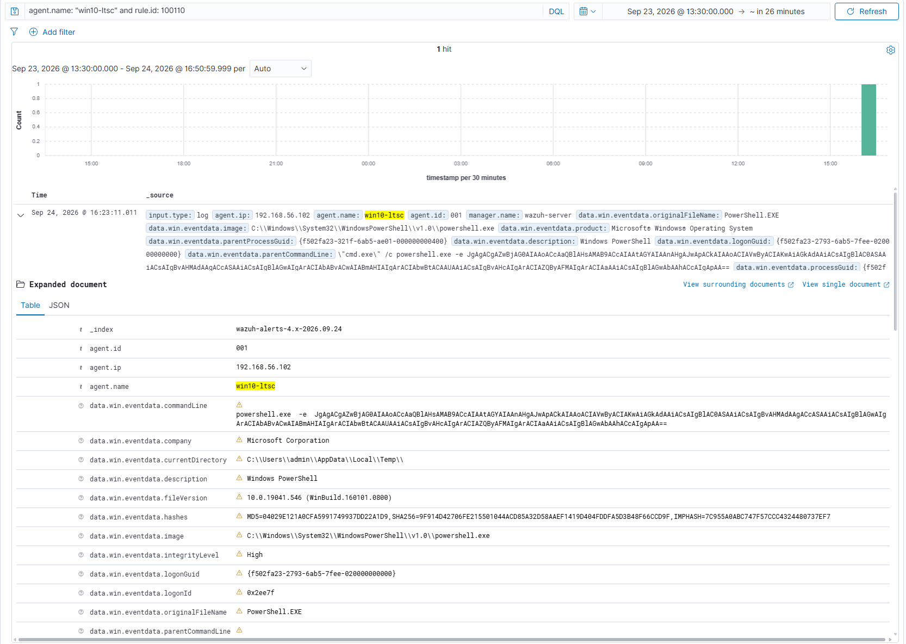

# Detecting Encoded PowerShell Execution with Sysmon and Wazuh

> All testing was performed in an isolated and authorized lab environment for educational purposes.

## 1. Objective

This lab validates endpoint detection coverage for **encoded PowerShell execution** using Sysmon, PowerShell Script Block Logging, Wazuh, and Atomic Red Team.

The objective was to generate a controlled PowerShell execution associated with **MITRE ATT&CK T1059.001 — Command and Scripting Interpreter: PowerShell**, collect the resulting telemetry, and create a custom Wazuh rule that detects the use of PowerShell's encoded-command parameters.

## 2. Lab Environment

The lab consisted of the following virtual machines on the `192.168.56.0/24` Host-Only network:

| System | Role | IP address |
|---|---|---|
| Windows 10 LTSC | Monitored endpoint | `192.168.56.102` |
| Wazuh Server | SIEM manager and dashboard | `192.168.56.101` |

The Wazuh agent was installed on the Windows endpoint. It forwarded both Sysmon and PowerShell Operational logs to the Wazuh server.


## 3. Telemetry Configuration

Two complementary Windows telemetry sources were used:

| Source | Event ID | Purpose |
|---|---:|---|
| Sysmon Operational log | `1` | Captures process creation, command line, parent process, user, integrity level, and process hashes. |
| PowerShell Operational log | `4104` | Captures PowerShell Script Block Logging content for investigation and context. |

The Wazuh agent configuration included both Windows Event Channels:

```xml
<localfile>
  <location>Microsoft-Windows-Sysmon/Operational</location>
  <log_format>eventchannel</log_format>
</localfile>

<localfile>
  <location>Microsoft-Windows-PowerShell/Operational</location>
  <log_format>eventchannel</log_format>
</localfile>
```

PowerShell Script Block Logging was enabled on the Windows endpoint to record Event ID `4104` in the `Microsoft-Windows-PowerShell/Operational` channel.

## 4. Atomic Red Team Test

Atomic Red Team was used to run a controlled validation test for PowerShell execution. The selected test was **T1059.001, Test #17: PowerShell Command Execution**.

This test launches PowerShell using the `-e` parameter, an alias for `-EncodedCommand`, with a Base64-encoded benign payload. The payload only outputs a test message and does not download files, modify system settings, or access credentials.

```powershell
Invoke-AtomicTest T1059.001 -TestNumbers 17
```

Expected output:

```text
Hello, from PowerShell!
```



## 5. Detection Evidence

### Process creation telemetry

Sysmon Event ID `1` captured the encoded PowerShell process execution. The observed process chain was:

```text
powershell_ise.exe
  └── cmd.exe /c powershell.exe -e <Base64 payload>
        └── powershell.exe -e <Base64 payload>
```

The following fields were extracted from the Sysmon event in Wazuh:

| Field | Value |
|---|---|
| `agent.name` | `win10-ltsc` |
| `agent.ip` | `192.168.56.102` |
| `data.win.system.providerName` | `Microsoft-Windows-Sysmon` |
| `data.win.system.channel` | `Microsoft-Windows-Sysmon/Operational` |
| `data.win.system.eventID` | `1` |
| `data.win.eventdata.image` | `C:\Windows\System32\WindowsPowerShell\v1.0\powershell.exe` |
| `data.win.eventdata.commandLine` | `powershell.exe -e <Base64 payload>` |
| `data.win.eventdata.parentImage` | `C:\Windows\System32\cmd.exe` |
| `data.win.eventdata.parentCommandLine` | `cmd.exe /c powershell.exe -e <Base64 payload>` |
| `data.win.eventdata.user` | `WIN10-LTSC\admin` |
| `data.win.eventdata.integrityLevel` | `High` |
| Built-in Wazuh rule | `92032` — Suspicious Windows cmd shell execution |
| Built-in rule level | `3` |



### Decoding the Base64 payload

The Base64 value recorded in the Sysmon command line was decoded with CyberChef using **From Base64** and **Remove null bytes**,

Decoded command:

```powershell
& (gcm ('ie{0}' -f 'x')) ("Wr"+"it"+"e-H"+"ost 'H"+"el"+"lo, fr"+"om P"+"ow"+"erS"+"h"+"ell!'")
```

The decoded command uses lightweight string concatenation and alias expansion:

- `gcm` is the alias for `Get-Command`.
- `('ie{0}' -f 'x')` resolves to `iex`.
- `iex` is the alias for `Invoke-Expression`.
- The concatenated strings resolve to `Write-Host 'Hello, from PowerShell!'`.

Therefore, the final behavior of the payload was equivalent to:

```powershell
Write-Host 'Hello, from PowerShell!'
```

This confirms that the Atomic Red Team payload was benign, while still demonstrating an execution pattern that should be investigated in a production environment.



### PowerShell Script Block Logging

PowerShell Event ID `4104` was also collected through the PowerShell Operational channel. It recorded script-block content from Atomic Red Team's execution framework:

```text
C:\AtomicRedTeam\invoke-atomicredteam\Private\Invoke-ExecuteCommand.ps1
```

Wazuh generated the following built-in alert:

| Field | Value |
|---|---|
| `data.win.system.channel` | `Microsoft-Windows-PowerShell/Operational` |
| `data.win.system.eventID` | `4104` |
| `data.win.eventdata.path` | `C:\AtomicRedTeam\invoke-atomicredteam\Private\Invoke-ExecuteCommand.ps1` |
| `rule.id` | `91822` |
| `rule.description` | `Powershell script used "Invoke-command" cmdlet to execute sub script` |
| `rule.level` | `12` |
| `rule.mitre.id` | `T1059.001` |



## 6. Custom Wazuh Detection Rule

The built-in rules detected parts of the execution chain, but the custom rule below was created to specifically identify Sysmon Process Create events where `powershell.exe` uses `-e`, `-enc`, or `-EncodedCommand`.

File: `/var/ossec/etc/rules/local_rules.xml`

```xml
<group name="custom,powershell,sysmon,execution,">
  <rule id="100110" level="10">
    <if_sid>92032</if_sid>
    <field name="win.eventdata.image" type="pcre2">(?i)\\powershell\.exe$</field>
    <field name="win.eventdata.commandLine" type="pcre2">(?i)(?:^|\s)-(?:e|enc|encodedcommand)(?:\s|$)</field>
    <description>Suspicious PowerShell execution with encoded command</description>
    <mitre>
      <id>T1059.001</id>
    </mitre>
    <group>powershell,encoded_command,sysmon,</group>
  </rule>
</group>
```

## 7. Custom Rule Alert

The custom rule successfully triggered on the Sysmon Event ID `1` generated by the encoded PowerShell execution.

| Field | Value |
|---|---|
| `rule.id` | `100110` |
| `rule.description` | `Suspicious PowerShell execution with encoded command` |
| `rule.level` | `10` |
| `rule.mitre.id` | `T1059.001` |
| `data.win.eventdata.image` | `C:\Windows\System32\WindowsPowerShell\v1.0\powershell.exe` |
| `data.win.eventdata.commandLine` | `powershell.exe -e <Base64 payload>` |
| `data.win.eventdata.parentImage` | `C:\Windows\System32\cmd.exe` |
| `data.win.eventdata.user` | `WIN10-LTSC\admin` |
| `data.win.eventdata.integrityLevel` | `High` |



## 8. SOC Triage Assessment

The use of `-EncodedCommand` is not inherently malicious. Legitimate administrative scripts and automation workflows can use encoded PowerShell commands. This detection should therefore be treated as a high-value investigation signal, not as a definitive malware verdict.

For this controlled lab, the alert was a **true positive for the detection logic** because Atomic Red Team intentionally executed PowerShell with an encoded command. The payload was benign and produced only `Hello, from PowerShell!`.

In a production investigation, the following context should be reviewed before determining whether the activity is malicious:

- User account and privilege level.
- Endpoint role and normal administrative activity.
- Parent and child process relationships.
- The decoded command or Script Block Logging content.
- Process hashes and file reputation.
- Network connections and DNS activity near the execution time.
- Frequency of encoded PowerShell activity across hosts.
- Related authentication, persistence, or credential-access events.

## 9. Detection Summary

| Phase | Evidence | Result |
|---|---|---|
| Attack simulation | Atomic Red Team `T1059.001`, Test #17 | Benign encoded PowerShell command executed |
| Process telemetry | Sysmon Event ID `1` | Captured `powershell.exe -e <Base64 payload>` and process tree |
| Payload analysis | CyberChef decoding | Confirmed benign `Write-Host 'Hello, from PowerShell!'` behavior |
| Script telemetry | PowerShell Event ID `4104` | Captured Atomic Red Team script-block content |
| Built-in detection | Wazuh rules `92032` and `91822` | Classified process and PowerShell script activity |
| Custom detection | Wazuh rule `100110` | Triggered at level `10` with MITRE `T1059.001` |

## 10. Conclusions

- Sysmon and PowerShell Script Block Logging provided complementary endpoint telemetry for PowerShell investigations.
- Atomic Red Team was used to safely validate a controlled encoded PowerShell execution scenario.
- The Base64 payload was decoded with CyberChef and confirmed to be benign while using execution patterns commonly associated with suspicious PowerShell activity.
- Wazuh ingested Sysmon Event ID `1` and PowerShell Event ID `4104` from the Windows endpoint.
- A custom Wazuh rule detected `powershell.exe` executions using encoded-command parameters and generated a level 10 alert.
- The detection was mapped to MITRE ATT&CK `T1059.001 — Command and Scripting Interpreter: PowerShell`.
- The lab demonstrates an end-to-end SOC workflow: simulate activity, collect telemetry, create a detection, validate the alert, and assess the result in context.